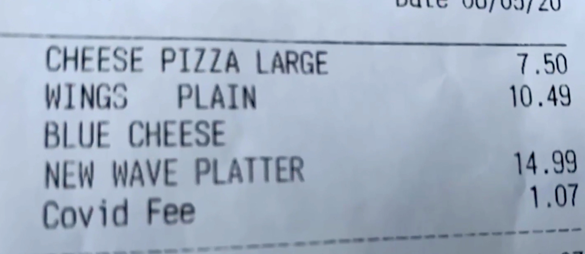
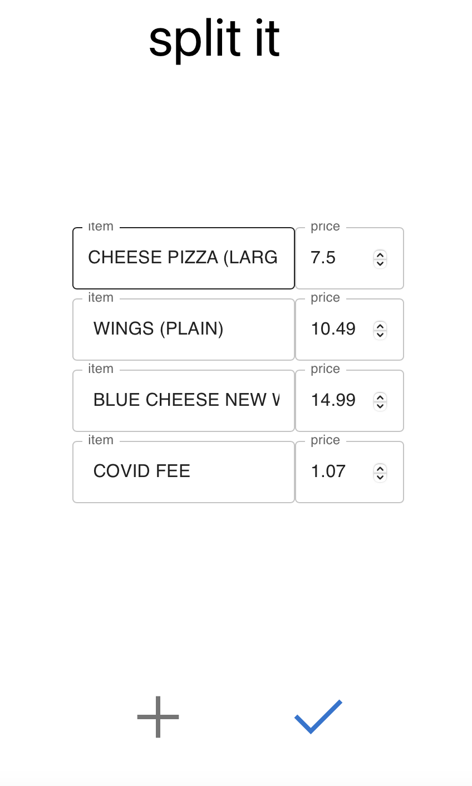
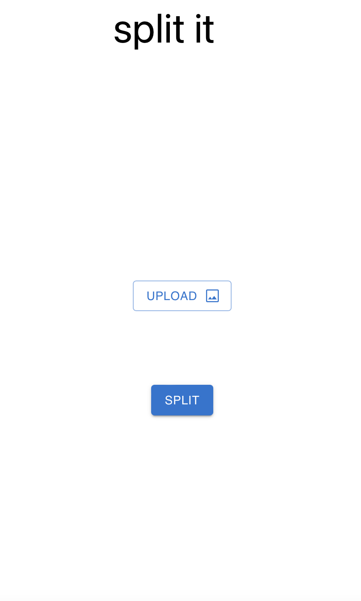

# Split-it
An AI-powered app that helps you split the bill with your friends. 

This is a beautiful React app supported by a Python backend, where we used Optical Character Recognition (OCR) and ChatGPT to build a general-purpose receipt parser that achieves state-of-the-art performance (as far as we know).

[**Demo Video**](https://drive.google.com/file/d/10i-0ATFyxK-_-pMLDm0Q6r14uR6BzkL1/view?usp=sharing)

## Demo
{ width: 200px; }
{ width: 200px; }
{ width: 200px; }


## setting up
```bash
# create python virtual environment
python3 -m venv env
source env/bin/activate
pip install -r requirements.txt
# install the npm packages
npm install
# set up chatgpt
1. create an account on OpenAI and make sure you can access ChatGPT in the browser
2. following instructions on this repo to inteface with ChatGPT in Python:
https://github.com/mmabrouk/chatgpt-wrapper 
```


## running
```bash
# run the flask server
flask --app base run
# run the react app
npm start
```


## how it works 
The receipt image uploaded by the user to the frontend, and then sent to the backend. 
The Python backend uses the OCR model to extract the text from the receipt image, and then uses the ChatGPT model to parse the text into a structured format, extracting information about what food items were purchased and how much they cost. 
These information were then in turn displayed on the frontend, and the user can split the items and their cost with their friends. 


## Acknowledgements
This app is created at Hack @ Brown 2023 by:
- Alan Gu
- Edward Xing
- Elizabeth Zhang
- Zhiyuan "Paul" Zhou
